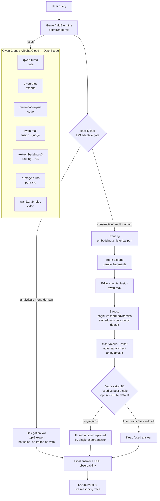

# Architecture — La Caverne aux 40 Voleurs (EN)

## Overview

An adaptive Mixture-of-Experts (MoE) multi-agent orchestrator built natively on **Qwen Cloud / Alibaba Cloud (DashScope)**. A single "Genie" routes each user query to the right Qwen experts ("Voleurs"), fuses their fragments into one voice, and can self-veto its own fusion.

## Request lifecycle

1. **Input guard** — safety scan of the query.
2. **Embedding** — `text-embedding-v3` (1024-d) of the query.
3. **Routing score** — `cosine(query, expert) × (0.6 + 0.4 × perf)` over the expert pool.
4. **Adaptive gate (L79)** — `classifyTask(query)`:
   - analytical mono-domain or low complexity → **delegation** to the top-1 expert, no fusion;
   - constructive multi-domain → top-k + fusion.
   - The delegation branch **returns directly** (`server/moe.mjs`, early return): no fusion, no sirocco, no traitor, no veto — a mono-expert answer has no fusion to challenge. The run records `traitor: { severity: "none" }`.
5. **Fragments** — parallel Qwen expert calls, strict per-specialty prompts.
6. **Editor-in-chief fusion (qwen-max)** — pick the best base fragment, integrate others only if they fix errors or cover gaps, single thesis, capped length.
7. **Sirocco** (`server/moe.mjs:541`, on by default, `MOE_SIROCCO=off` disables) — cognitive-thermodynamics reading over the fragments (heat / drift / state); embeddings only, no extra LLM call.
8. **40th Voleur (Traitor)** (`server/moe.mjs:550`, on by default, `MOE_TRAITOR=off` disables) — adversarial post-fusion check; on a **major** objection the corrected answer replaces the fused one. Fusion path only.
9. **Mode veto (L80)** (`server/moe.mjs:565`, opt-in `MOE_MODE_VETO=on`, **OFF by default**) — runs **last, after the traitor**, on the possibly-corrected answer: the best single expert answers alone and a qwen-plus judge compares fused vs single in randomized pairwise A/B; if single wins, the fused answer is replaced. **Experimental and not benchmarked — we claim no measured gain from it.**
10. **Observability** — every step is streamed over SSE to **L'Observatoire** (selected agent, why, cost, latency, confidence, fusion, sirocco, traitor, veto, decision history).

> Steps 7–9 apply to the **fusion path only**, in that order. Verified against `server/moe.mjs`: Sirocco L541 → Traitor L550 → Mode veto L565.

## Qwen family orchestration

| Role | Model | Why |
|---|---|---|
| Router / cheap expert | `qwen-turbo` | fast, low-cost classification + simple fragments |
| Experts | `qwen-plus` | quality per specialty |
| Code expert | `qwen-coder-plus` | production-grade code |
| Fusion + judge | `qwen-max` | deepest reasoning, single-narrator fusion, impartial judge |
| Routing + KB embeddings | `text-embedding-v3` | 1024-d semantic routing |
| Portraits | `z-image-turbo` | sync image generation |
| Video | `wan2.1-t2v-plus` | async video generation |

## 12 pillars / 81 layers (L0–L80)

| Pillar | Layers | Files |
|---|---|---|
| Persistence | L0–L6 | `server/store.mjs`, `server/persistence/` |
| Humanity | L7–L14 | `server/humanity/` |
| KB — Runes du Coffre | L15–L22 | `server/kb/`, `server/routes/kb.mjs` |
| User profiling | L23–L30 | `server/profiles/` |
| Abliterated / guards | L31–L36 | `server/moe.mjs`, `server/guards/` |
| Tools | L37–L44 | `server/tools/` |
| Autonomous agents | L45–L52 | `server/agents/` |
| Vision | L53–L58 | `server/vision/` |
| Shared mind | L59–L66 | `server/sharedMind/` |
| Multimodal gen | L67–L72 | `server/gen/` |
| Fable 5 (Qwen Cloud bridge) | L73–L78 | `server/fable5/` |
| Ultimate orchestration | L79–L80 | `server/moe.mjs`, `server/orchestrator.mjs` |

Verified by `node scripts/audit-layers.mjs` → **81/81 implemented**.

## Benchmark methodology (reproducible)

- **Pairwise A/B randomized** (anti position bias).
- **Double judge** — `qwen-max` + `qwen-plus`, victory only if both agree (tie otherwise).
- 4-criteria rubric: exactitude, complementation, profondeur, actionabilité (0–5 each, total /20).
- 5 reps per question, mean ± std. Baseline = `qwen-turbo` single agent, same prompt, same judge.
- Reproduce: `node scripts/bench-hard.mjs [genieId] [baseline] [reps]` then `node scripts/hero-table.mjs bench/<v1>.json bench/<v2>.json`.

## Provider policy

Only **Qwen Cloud / AI Studio (DashScope), Alibaba Cloud, Ollama Cloud**. No OpenRouter, no Anthropic, no other provider. Verified: no `anthropic/claude-*`, `sk-or-`, or `OPENROUTER_API_KEY` in tracked files.

## Stack

- **Backend:** Node.js 18+ ESM, zero external dependency (native fetch). Port 8787.
- **Frontend:** React 18 + TypeScript + Vite. Port 5273. Monaco editor self-hosted.
- **Sandbox:** Docker (restricted spawn fallback).
- **Tests:** 25/25 green. `npm run typecheck`, `npm run build` green.
